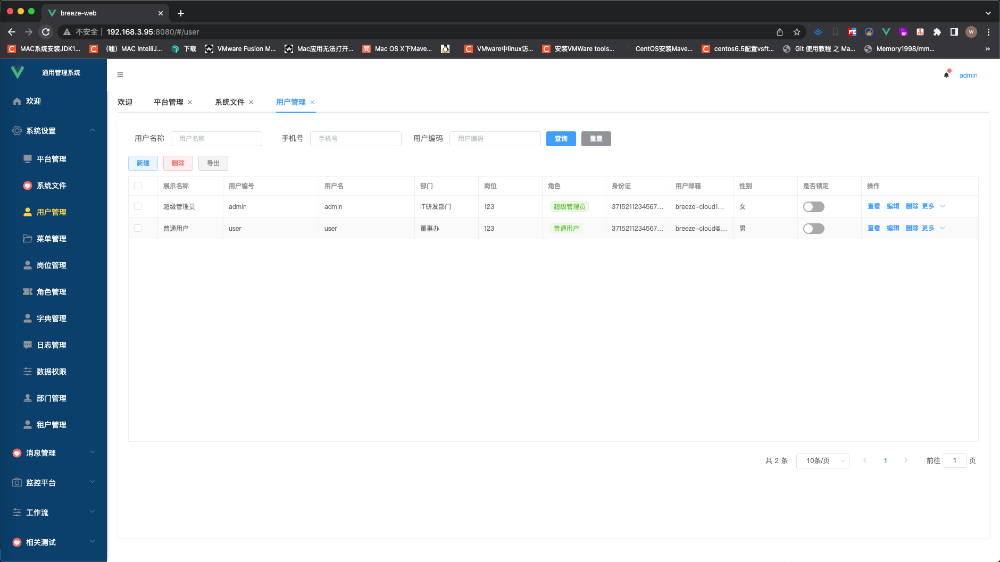

# Breeze-web

### 平台简介

##### Breeze-web 是基于RBAC的权限管理系统，包括用户管理、角色管理、菜单管理、权限管理等功能，适合Java开发者入门学习或者直接用此项目。

- 前端采用Vue、Element UI。
- 后端采用Spring Boot、Spring Security、Redis、Jwt、Druid。
- 权限认证使用Jwt、支持按钮级别的权限控制
- 支持加载动态权限菜单，多方式轻松权限控制。
- 后端代码，请移步
    - [github https://github.com/memory1998/breeze-boot](https://github.com/memory1998/breeze-boot)
    - [gitee https://gitee.com/memoryGiter/breeze-boot](https://gitee.com/memoryGiter/breeze-boot)

### 特别鸣谢：

- [验证码 https://gitee.com/anji-plus/captcha](https://gitee.com/anji-plus/captcha)
- [流程设计器 https://gitee.com/MiyueSC/bpmn-process-designer](https://gitee.com/MiyueSC/bpmn-process-designer)

# 请遵循 Apache 2.0 协议

### 功能菜单

##### 后端

- 管理系统 \
  ├─ 系统设置 \
  │ ├── 平台管理 \
  │ ├── 用户管理 \
  │ ├── 菜单管理 \
  │ ├── 岗位管理 \
  │ ├── 角色管理 \
  │ ├── 字典管理 \
  │ ├── 日志管理 \
  │ ├── 数据权限 \
  │ ├── 部门管理 \
  │ ├── 租户管理 \
  │ ├── 系统文件 \
  ├─ 消息管理 \
  │ ├── 用户消息 \
  │ ├── 消息公告 \
  ├─ 监控平台 \
  │ ├── swagger \
  │ └── 德鲁伊

##### 前端

- breeze-web \
  ├─ images 项目截图 \
  │ ├─ src \
  │ │ ├─ api \
  │ │ ├─ assets \
  │ │ ├─ components \
  │ │ ├─ mixins \
  │ │ ├─ plugins \
  │ │ ├─ router \
  │ │ ├─ store \
  │ │ ├─ utils \
  │ │ └──views

#### 项目安装

```
yarn install
```

#### 项目启动

```
yarn serve
```

启动后浏览器访问 http://localhost:8080

### 前端界面相关





